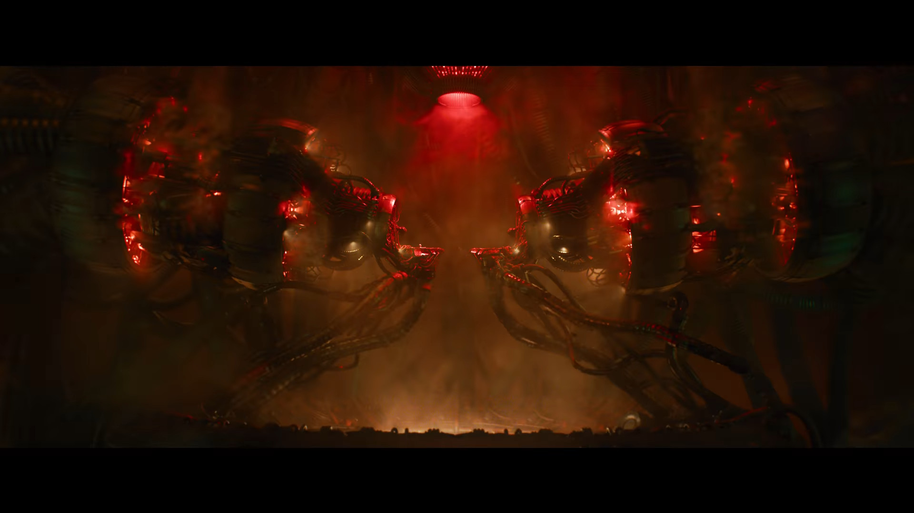

+++
Author = "Lord"
Description = "Bon ça fait deux mois que la bande annonce de Matrix 4 est sortie et je suis vraiment hypé. Tant de questions pour cette suite et ce trailer est vraiment très chouette."
Categories = ["cinéma", "matrix"]
menu = "main"
notoc = true
WritingDate = 2021-11-13T09:38:25+01:00
date = 2021-11-13T09:38:25+01:00
title = "Je suis hypé par Matrix 4"
editor = "kakoune"
+++
J'aime beaucoup le cinéma, je pense que si vous me suivez vous avez probablement remarqué que c'est un des passe-temps qui m'occupe pas mal.
Un genre qui me plaît particulièrement est la science-fiction (surtout si c'est teinté d'un peu d'action (ouai j'ai été élevé par *Arnold Schwarznegger*)).
**Matrix** est un film qui m'a directement scotché.

Ce film est une pure tuerie.
Son histoire est vraiment cool, ses effets spéciaux même aujourd'hui en jette, son thême est toujours d'actualité vingt ans plus tard.
Son esthétique tient toujours la route (bon ok le look vestimentaire est devenu cliché mais il a popularisé cette mode).
Et il a engendré deux suites qui bien que pas aussi bonnes sont tout de même bien solides.
Le deux est sacrément bon et le trois bha … étrangement il me marque beaucoup moins au point que je ne me souvienne pas trop de ce qui s'y passe (je me le suis très peu vu au final, mais je compte me rattraper avant la sortie du 4 je vous le promets !).

Ce quatrième épisode arrive donc près de vingt ans après le précédent opus.
À la réal on ne retrouve plus que *Lana Wachowski*.
C'est un peu étrange (surtout pour elle j'imagine), après tout **Matrix** c'est leur gros bébé à elle et sa sœur et là n'être que seule dessus doit être … une sensation très étrange.
Je ne sais pas quel est leur ressentie à toutes les deux mais doit y avoir une pression supplémentaire.

Bref, ce nouveau film est dans les tuyaux depuis bien des années et ça va très bientôt se concrétiser au cinoche.
De nombreuses scènes ont été filmées en pleine ville et donc des images de tournages tournent sur youtube depuis quelques années déjà (ouai j'ai été faible j'ai regardé).
Par contre, je résiste à 100% a l'envie de regarder des explications, analyses et compagnie concernant ce nouveau film.
Par contre je ne résiste pas à l'envie de vous partager mes théories et mes questionnements.

## C'est parti !

### Qui qui joue ?
Déjà, niveau casting on retrouve *Keanu Reeves* (bon c'est pas trop une surprise) mais aussi *Carrie-Anne Moss* (c'est déjà plus intrigant), par contre on dirait que *Morpheus* a changé d'acteur (bon c'est ptet pas exactement *Morpheus* mais ça y ressemble aussi bien physiquement que dans ce que fait le personnage).
Bon par contre, j'ai bien peur qu'*Hugo Weaving* ne soit plus là pour jouer les agents retors.

### Ça sonne bien
Déjà, le premier truc qui claque c'est la musique !
Les précédentes bande-annonce et globalement les films avaient optés pour de la musique plus énervée soit plus nu-metal soit plus électronique.
Ici, on a un bon vieux rock psychédélique bien rétro !
**White Rabbit** de *Jefferson Airplane* n'est cependant pas un choix si surprenant : cette musique est pas mal inspirée d'**Alice aux Pays des Merveilles** tout comme … bha **Matrix**.
Les films sont truffés de références à cette œuvre du coup bha ce morceau colle bien dans son ambiance.
En plus cette version fait donc un lien entre un morceau qui commence à être pas mal vieux tout en y ajoutant des synthés bien plus modernes et des sonorités propres à la saga.

### Ça flatte la rétine
Second truc qui marque directement c'est que c'est bien moins green qu'avant !
Fini l'étalonnage verdâtre/déprime/crasse/moisissure/roquefort, on a des couleurs bien plus chaudes, saturées.
C'est vraiment très joli.
Fini le cyberpunk des 90s et bienvenue aux néons et couleurs pimpantes (on est quand même en pleine vague de rétro 80 et ça ressort très légèrement ici).

Rappelez-vous d'ailleurs.
À la fin du 3 on voit déjà que le vert disparait pour prendre ces couleurs un poil plus naturelles.
C'est bien le signe qu'une matrice vient de se terminer et qu'une nouvelle démarre avec de nouvelles règles.

On a un court extrait d'une ouverture de porte où le sol devient le plafond et vice versa avec un mouvement de caméra des plus vif.
Ça a un ptit goût d'**Inception** (qui, on ne va pas se mentir, s'est un peu inspiré de **Matrix** donc c'est un juste retour) qui n'est pas pour me déplaire.

### L'héritage
Le trailer est court (enfin un peu long pour un trailer à mon goût avec ses 3 minutes mais passons) et pourtant il y en a de la matière là-dedans.

Un détail étrange c'est l'apparition à plusieurs reprises d'extraits du premier.
Et c'est pas juste un effet de montage (sérieux, regardez le trailer vous verrez) mais c'est vraiment intégré dans la diégèse du film.

C'est étrange mais au final possible : après tout, les images montrées sont des extraits de moments s'étant déroulées dans la matrice.
Du coup il est plausible que l'*Architecte* ait dégainé son magnétoscope pour enregistrer des morceaux et s'amuse à les intégrer dans une nouvelle matrice.

Un autre écho du premier film c'est la présence d'une meuf avec un tatouage de lapin.
Là où dans le premier c'est un personnage qui n'a quasiment aucun intéret (on ne connait pas son nom et son seul rôle c'est de pousser *Thomas Anderson* à sortir afin de rencontrer *Trinity*) alors qu'ici … wow on a un personnage qui semble pas mal central.
Badass et prêt à la castagne.

Ici on voit des miroirs semblant servir de portails.
Est-ce qu'ils remplacent les vieillissantes cabines téléphoniques ?
Faut dire qu'en 2021, utiliser une cabine téléphonique pour sortir de la matrice ça doit être très compliqué.
Étrangement, dans le 1 je me suis toujours dit que le miroir qui agit bizarrement n'était qu'une illusion de *Néo* suite à l'ingestion de la pillule et non un vrai objet physique qui agit comme il le fait.
Ici, ils semblent avoir un plus grand rôle.

Le nouveau *Morpheus* semble amener *Néo* dans un dojo pour lui redonner ses quelques cours de Jiu Jitsu.
Un écho au premier encore une fois.

On dirait que l'on va avoir une scène d'action dantesque dans un train ce qui pourrait faire écho à la station de métro du premier ou plus largement à l'autoroute du 2.

Franchement ça a de la gueule de voir *Néo* stopper les balles.
Mais là ils ont monté le niveau d'un cran en le faisant rediriger une rocket d'hélicoptère.

Il y a de la fuite en moto encore.
D'ailleurs à ce moment-là, les passants ne semblent pas fuire le danger mais au contraire ils tentent de stopper le bolide voir de chopper *Néo* et *Trinity* qui s'y trouvent.
Et si on regarde bien, un des passants a les yeux qui luisent d'un vert très matrixien.
Du coup est-ce que les agents peuvent désormais prendre le contrôle des gens sans pour autant récupérer leur apparence d'agent ?
Pourtant on voit bien par moment des agents à l'apparence d'agent…

### Hors de la matrice
La très grande majorité du trailer semble se dérouler dans la matrice.
Mais on a quand même quelques images hors de la matrice.

On voit le Nebuchadnezzar voler dans une cathédrale avec pas mal de lumière semblant venir de dehors.
Est-ce que l'environnement s'améliore et la météo devient plus clémente ce qui serait vraiment plus favorable à une révolte des humains ?

On voit quelques images de *Néo* naissant une nouvelle fois.
Il sort de son cocon sauf que le trailer est assez joueur : les images ne montrent quasiment que du plan assez rapproché à ce moment.

Sauf qu'au début, le trailer enchaine des images limites subliminales (seulement deux images d'affilées (ouai j'ai regardé image par image, mais bon je suis hypé !!)) et dans ces rafales d'images on peut voir que son cocon n'est pas mélangé avec le reste de la populace dans une tour de cocon comme l'on a vu dans les précédents épisodes.
Là il semble avoir un traitement de faveur et il a probablement un voisin.
Qui ça pourrait être ?
*Trinity* ?
 
{{}}

### Hors de la diégèse
Vous avez remarqué que lorsque le film affiche tout fièrement son titre avec son classique effet visuel de glyphes verts (et blanc) qui s'éffacent en tombant du haut… bha … certains vont dans l'autre sens, vers le haut ?
Et puis il y en a ensuite des jaunes avec une lumière provoquant un halo jaune qui eux aussi remontent à la vraiment toute fin ?

## Théories

### Trinity est belle et bien morte
Je sais pas pourquoi mais j'ai comme l'impression que *Trinity* n'existe pas dans ce film.
Après tout elle est morte dans le trois.
*Néo* bien que dans la ville des machines n'est pas officiellement mort dans le trois, tout juste blessé.
Du coup, il est envisageable que les machines l'aient sauvé (pourquoi ?).

À plusieurs reprises *Trinity* est étrange dans ce trailer.
À un moment elle a les glyphs verts de la matrice qui lui coulent de la joue.
Un peu à l'instar de l'environnement de la matrice, du coup elle n'est qu'un programme de la matrice.

À un autre moment, on la voit crier alors qu'elle est en pleine baston.
Et l'image la multiplie, elle apparait donc cinq fois (enfin plus mais trop flou pour bien discerner les autres).
Sauf que … sur ces cinq images, il y en a deux où le visage n'est pas celui de *Trinity* mais de quelqu'un d'autre !



Du coup, je pense que *Trinity* est bien morte, mais que quelqu'un se fait passer pour elle afin de réveiller *Néo*.
Après tout, c'est par elle que *Néo* s'échappe de la matrice dans le premier.

À mon avis, ce sont les humains hors de la matrice, qui se servent de son apparence pour faire sortir *Néo* et que donc, le second cocon montré plus haut, ne contient effectivement pas *Trinity* (à moins qu'elle ait été résurrecté par les machines mais que les humains et *Néo* ne sont juste pas au courant encore et qu'il va falloir aller la chercher).
Bref, des humains se servent de *Trinity* comme d'un avatar.
Est-ce que la meuf aux cheveux bleus prend les commandes ?
Elle semble assez proche du nouveau *Morpheus*.

Elle tombe de l'immeuble comme *Trinity* dans le 2 aussi…

### L'architecte
En fin de trailer, on a une rencontre entre un personnage qui semble très au fait de la matrice et du passé de *Néo*.
C'est donc un personnage qui est soit hors de la matrice soit un des manipulateurs.

Et donc, ne serait-ce pas l'*Architecte* qui troque son costar blanc pour un truc un peu plus passe-partout ?

Après c'est ptet moi qui délire mais on le voit à un autre moment en train d'affronter *Néo* en combat à main nue en se jettant l'un sur l'autre.
Enfin je crois que c'est lui.
Il n'y a que quatorze images… floues… de loin.

Mais si c'est vraiment le cas ça risque d'être un affrontement des plus épiques.
Entre l'élu qui arrive à manipuler la matrice et bha le créateur himself.

Jésus vs Dieu !!!

## What's the matrix ?
Bon vous faites quoi le 15 Décembre 2021 ?
