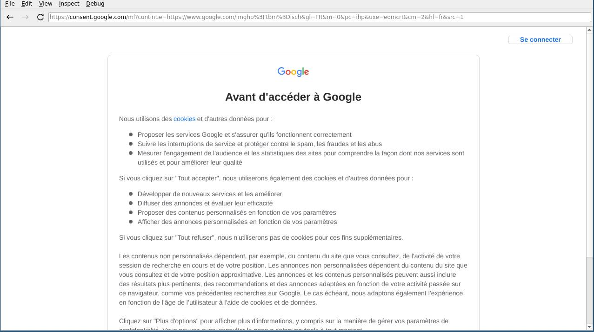

+++
Author = "Lord"
Description = ""
Categories = ["web", "software"]
menu = "main"
notoc = true
draft = true
WritingDate = 2023-07-31T22:45:37+02:00
date = 2023-08-03T22:45:37+02:00
title = "Ladybird : Futur sauveur du web"
editor = "helix"
Audio = ""
Soustitre = "À mort Chrome !"
TopWords=["web","navigateur","google","chrome","chromium","gouvernance","moteur","css","js","javascript","drm"]
+++
Cet article est un peu long.
Il y a deux parties : 

  - [La situation actuelle des navigateurs et pourquoi ça me fait chier (pas merci Google).]()
  - [Ladybird un futur navigateur web qui me redonne de l'espoir]()

Il y a des chances que seule une partie vous intéresse, faites comme vous le sentez je suis payé pareil ;-)

## Google m'emmerde.
J'ai été un fanboy de cette entreprise quand leur leitmotiv était encore le fameux “Don't be evil” mais c'était il y a fort longtemps.
J'étais tout heureux quand j'ai pu avoir mon invitation Gmail quelques semaines après leur ouverture en beta.

Mais j'ai réalisé à quel point *cette boîte était de plus en plus néfaste* et je ne sais pas si c'est eux qui ont changé ou moi mais désormais je ne ressens plus que leur avidité de pognon.
*Je me suis dégooglisé il y a quelque temps déjà*.
D'ailleurs je ne me souviens plus exactement quand mais en fouillant un peu, [mon cinquième blog post d'Aout 2009]() est nommé “Dégooglistation” (n'y allez pas il me fait honte).

Donc nous voilà quinze ans plus tard, je n'utilise plus aucun service Google sauf Youtube, sauf Google Maps, sauf Android, sauf …
Vous voyez le topo.
Bon pour les services restant j'ai de bonnes excuses (bon par pour youtube) et je ne le fais pas de gaieté de cœur et je tente de me protéger au max (pas de compte sauf un compte bidon créé exprès pour android), visualisation des vidéos via mpv, désactivation autant que possible d'apps made in Google et autres subterfuges du genre.

*J'estime être parvenu à n'avoir que très peu de liens avec Google* au final (il y a toujours moyen de faire mieux mais ça demande des efforts/sacrifice que je ne suis pas prêt à faire).
Je me sens suffisamment détaché de Google au point que *leurs nombreuses conneries ne m'affectent que très peu voir pas du tout*.
Et pourtant, là, ils recommenent à m'emmerder sévère (on arrive enfin à la première phrase de l'article (mais toujours pas au sujet de l'article)).
Leur nouvelle idée se nomme **WEI** pour **W**eb **E**nvironment **I**ntegrity.

Pour résumer *c'est de la pure grosse merde*.
Pour moins résumer, leur but est de **s'assurer qu'une page envoyée par un serveur web soit affichée parfaitement à un humain**.
Le but est de s'attaquer frontalement aux bloqueurs de pub et autres extensions de protection de la vie privée et également au scraping.

*C'est une sorte de DRM pour page web*.
Vous savez ce qui vous empêche de regarder les sites de streaming légal sur l'appareil que vous possédez ? Ce sont les DRM.
Vous savez ce qui vous empêche de transférer facilement vos boquins vers votre e-reader ? Ce sont les DRM.
Vous savez ce qui vous empêche … Voilà ce sont les DRM.
Bha là, le World Wide Web est à deux doigts de s'en doter et tout ça de l'initiative de Google.

En gros, si ça se fait, *les créateurs de site ouaib pourront implémenter ça et donc seuls les navigateurs autorisés, sur les OS autorisés, avec les règlages autorisés pourront afficher les pages web autorisées*.
Ça fait rêver, hein ?

Le problème c'est que c'est Google qui pousse ça.
Il ne faut jamais perdre de vue que *la très grande majorité du pognon que ramasse Google c'est en vendant de la pub ciblée*.
La fête est finie : **ils sont parvenus à s'accaparer quasiment toutes les parts de marché des navigateurs de façon directe ou indirecte et donc peuvent imposer leur DRM très facilement**.
Bref, j'ai pas envie d'entrer plus dans les détails.

Voilà ce qui m'enrage ces derniers jours.
Mais du coup pourquoi toute cette intro interminable ?
Parceque j'ai envie de parler de navigateurs web !

## L'offre pléthorique de navigateurs web
Le web est devenue un bien commun il y a maintenant trente ans.
Et en trente ans il y en a eu des tas de logiciels pour surfer !

*Le web a grandi, de nouvelles technos se grefféent constamment, l'informatique a changé de formes plusieurs fois entre-temps*.
Mosaic/Netscape/Internet Explorer/Opera/Firebird/Firefox/Safari/Konqueror/Chrome/Brave/Vivladi
Je ne vais pas tous les lister, ça n'a aucun intéret et j'en raterais plein.

Avançons en l'an de grâce 2023 (à peu près, c'est pas l'Histoire, c'est mon ressenti et ma mémoire qui parle) et voyons un peu ce qu'il se cache derrière 99% des navigateurs.
Ce qu'on apelle un navigateur est en fait un ensemble de multiples briques et pour simplifier il y en a trois principales : 

  1. Le moteur de rendu
  2. Le moteur javascript
  3. L'enrobage fonctionnel

*Il y a des dizaines de navigateurs et pourtant on ne dénombre que trois moteurs de rendu* : **Blink** (utilisé par Chromium) / **Webkit** (utilisé par Safari) / **Gecko** (utilisé par Firefox).
Ce point est à mon sens un très grave problème : il y a un manque évident d'alternatives.
Plus le temps passe, plus les standards du web deviennent complexes et nombreux et il est donc de plus en plus difficile de coder un navigateur complet.
C'est une tâche qui est désormais considerée comme Herculéenne.

Microsoft a lâché l'affaire récemment en abandonnant leur moteur (Trident mais bon il était à la ramasse) pour pomper celui de Chromium pour leur dégueulasse Edge.
Google pour Blink n'a pas commencé de 0 mais est parti de Webkit.
*Ces trois moteurs ont commencé leur existance il y a plus de vingt ans* à une époque où le web était bien différent.

Le moteur de javascript n'est à mon sens pas très important dans le grand schéma, c'est au final une brique plus simple que la précédente et ce n'est pour le moment pas problèmatique.
Le moteur de rendu et le moteur javascript sont très liés l'un à l'autre et il est donc difficile de les mixer.

"L'enrobage fonctionnel" (c'est mon terme) est ce qui rajoute tout le sel à un navigateur (gestion des cookies, l'interface graphique, gestion des paramètrages, gestion des mots de passe, gestion de l'historique, gestion des onglets).
*C'est typiquement cette brique qui change entre un Chromium, un Brave, un Vivaldi, un Samsung Browser, …*
Cette brique est en abondance.
Et même si pour l'utilisateur c'est la plus importante, d'un point de vue plus politique globale elle n'a que peu d'importance.

## Dégoogler son navigateur
Chrome est arrivé en 2008 avec une campagne marketing extraordinaire.
*En très peu de temps il est devenu le navigateur web dominant et malheureusement ça lui donne un poids politique très considérable.*
Ce que Google choisit de faire dans son navigateur va impacter presque tous les navigateurs.
Google a réussi son coup avec son cheval de Troyes.

Les rares contre-pouvoirs sont Mozilla et Apple.

Mozilla le "défenseur du web libre" peine de plus en plus à rassembler du monde.
Ils sont en grande partie dépendants du pognon que leur verse Google pour être le moteur de recherche par défaut (même si je pense que ça les arrange d'éviter d'être en position de monopole grâce à cette ptite perfusion qui garde à peine Mozilla en vie).
Alors qu'*une dizaine d'années auparavant les geeks encensaient Firefox et contribuaient à sa popularité ce n'est presque plus le cas à cause de nombreux soucis* que je n'aborderai pas ici.

Apple malgré ses parts de marché dérisoires sur les ordinateurs parviennent finalement à lutter grace à leurs iPhone où les moteurs de rendu concurrents sont simplement bannis.
Ce qui à première vue semblait une décision à l'encontre de ses consommateurs et au final l'un des plus gros contre-pouvoirs face à l'hégémonie de Google sur le web.
Parceque oui *les millions d'utilisateurs d'iTrucs sont une cible marketing que le web commercial ne peut snober*.

Le nouveau délire qu'est **WEI** est la goutte de trop et je pense qu'il devient de plus en plus important de se séparer de combattre l'emprise de Google sur le web.
Mais du coup c'est pas juste de Chrome dont il faut s'éloigner mais également tous les navigateurs bâtis sur les fondations de Chromium.
Ça inclue donc la très grande majorité des navigateurs sauf **Safari** et **Firefox** (et leurs rares dérivés).

Cette situation de disette de moteurs de rendu est vraiment chiante puisqu'*on se retrouve au final avec à peu près rien*.

## Enters Servo
En 2012, Mozilla bossait sur le langage Rust.
Et pour éprouver ce nouveau langage et le faire grandir, ils se sont lancé dans la création de **Servo** un nouveau moteur de rendu repartant de 0.

*C'est le premier projet de moteur de rendu from scratch depuis près de quinze ans.*
Les autres moteurs sont fonctionnels mais datent d'une autre époque : c'est du code qui a vécu, a été patché des milliers de fois, pour implémenter des standards qui sont nés, ont évolués et pour certains disparus.
Bref, **Servo** avait pour but de *commencer de 0 avec donc maintenant de l'expérience, du recul et surtout un nouveau langage de programmation.*

(bon l'article commence à être trop long donc j'abrège)

**Servo** est pas mal malmené par Mozilla.

Rust a grandi et commence à gagner pas mal en popularité et est désormais utilisé sur de nombreux projets.
Différents modules de Servo sont directement récupérées et intégrées à Gecko.
Mozilla réaffirme à plusieurs reprises que non, Servo n'est qu'un laboratoire et qu'il n'y a aucun plan pour remplacer Gecko.
Mozilla décide d'axer la roadmap de Servo à fond vers … 🥁 la VR !
Voilà, *à chaque nouvelle décision de Mozilla Servo perd en intéret*.

Bref, ça patauge ça s'enlise et la hype retombe.
*Mozilla abandonne donc Servo* dans un état assez peu utilisable.
Les morceaux les plus intéressants ont été récupérés pour intégrer Firefox (c'est déjà ça).

Trois ans plus tard, c'est la Linux Foundation qui récupère le bébé et en 2023 ça y est des signes de vie, une roadmap avec du code et tout.
Faut espérer qu'après la gestion calamiteuse du projet par Mozilla, ça puisse enfin décoller.
*je vous avoue que ma hype est retombée depuis des années*.

## Here comes Ladybird !
Le voilà le sujet principal de cet article !
J'a fini de digresser !

### SerenityOS
Alors que le monde est morose et que l'espoir et la hype n'est plus qu'un lointain souvenir, vla que débarque un nouvel arrivant sorti de nulle part : **Ladybird**.
C'est un tout nouveau projet de navigateur issu d'un projet plus vaste encore d'OS complet nommé **SerenityOS**.

Ça a *commencé comme un ptit projet sans trop d'ambition de la part d'une personne*.
C'est avant tout un projet d'un dev qui souhaite changer un peu d'air et se lance là-dedans en streamant ses sessions de programmation.
Le but est de créer *un OS proche d'unix mais avec une UI qui lorgne du côté de win9x*.

Puis quand la partie OS était suffisamment avancé la question d'avoir un navigateur s'est posé.
Et *quitte à refaire tout un OS, ce serait dommage de ne pas faire son propre navigateur de 0*.

### LibWeb + LibJS == browser
*C'est la naissance de **LibWeb** un tout nouveau moteur web.*
À cela on y greffe un moteur de javascript lui aussi tout neuf avec **LibJS**.
Il ne manque plus qu'à enrober tout ça et on a ébauche de navigateur web.

C'est vite devenu *la plus grosse brique de Serenity et celle qui attire le plus d'enthousiasme même hors de l'OS*.
Ce qui commençait sans trop d'ambition et qui allait à l'encontre du fameux “créer un navigateur web de 0 est désormais impossible” a dépassé les frontières de SerenityOS.
Il faut dire que *les progrès sont assez faramineux*.

Contrairement aux autres navigateurs, ses implémentations s'appuient sur les normes les plus modernes qui sont bien mieux rédigées qu'avant.
La quantité de code est bien moindre que les autres ce qui est bien moins intimidant pour un nouveau participant au projet.
*Il y a très peu de code legacy, c'est du C++ moderne avec pas mal de commentaires et de nombreuses séances de programmation ayant été filmée, ça peut également fournir des explications concernant certaines lignes.*

### Dépasser Serenity avec Ladybird
SerenityOS c'est cool (j'ai pas testé et ça ne m'intéresse guère je dois l'avouer) mais bon ça me fait une belle jambe d'avoir un nouveau navigateur sur cette plateforme.
C'est là que **Ladybird** entre en jeu : c'est un portage sur les autres OS !
Il y a une fine couche de Qt6 pour ajouter de l'UI et hop et geré l'aspect réseau pour le moment.

Bon bha du coup *c'est utilisable ou au moins testable sous Linux !*
Allez hop je dégaine le compilo !
(ouai c'est pas encore arrivé chez Gentoo donc faut aussi dégainer git et se faire ça à la main.)

Alors par contre attention, *le projet bien qu'ayant déjà 4 ans est resté pendant longtemps un minuscule projet réalisé sur le temps libre d'une personne*.
Bien qu'il ait attiré des passionnés rêvant d'un renouveau dans le monde des navigateurs, ça reste un projet minuscule comparativement aux autres acteurs du secteur.
Il n'y a qu'une seule personne à temps plein sur le projet (et encore c'est pour tout SerenityOS et non juste Ladybird).
Bref, *il ne faut pas s'attendre à un truc 100% fonctionnel dès aujourd'hui*.

## Petit tour de Ladybird
Déjà le premier point qui fait trèèèès plaisir c'est le temps de compilation.
J'ai un ordi pas trop pourri et pour compiler qtwebengine (le moteur de rendu de mon navigateur usuel basé sur chromium) c'est environ 2h30 avec le CPU à fond et un bon paquet de RAM.
Là *pour compiler Ladybird depuis les sources c'est environ 4 minutes*.
Bon cela va sans dire que ça s'explique en grande partie par le fait que c'est bien moins bourré de ~~bloat~~ fonctionnalités et que ça va surement s'allonger mais ça part de tellement loin.



Ça ressemble à un navigateur des années 2000 (ça colle à l'esthétique de Serenity)



Bon bha c'est sobre.
Ça a quoi dans le ventre ?


Je suis sacrément impressionné par cette performance !

Bon bha testons le site ouaib le plus utilisé du monde !

{{}}

Non par contre ce qui m'impressionne le plus c'est pas ça.

{{}}

Bon bha rien ne lui résiste ?
Il sait déjà afficher toutes les pages web san ssouci ?
Et votre site favori ça donne quoi ?

{{}}

Hannnn mon site ouaib donne plus de fil à retordre que Google Street View !

D'un point de vue performance c'est trèèèès lent.
Mais ils ont déjà annoncé qu'ils tentaient d'abord de faire un truc fonctionnel et que l'optimisation pour les perfs ça viendra bien plus tard.
Il me tarde que les performances soit le point gênant ^__^

## Suivre les news de Ladybird
Le mieux pour voir les avancées est de suivre [la chaîne Youtube](https://www.youtube.com/@awesomekling/videos) d'Andreas Kling (et ouai on revient chez Google).

Il y a notamment un récap mensuel des avancées qui est assez intéressant et sinon il y a tout simplement [le site de SerenityOS](https://serenityos.org/).
Le [blog de Linus Groh](https://linus.dev/posts/) qui bosse beaucoup sur Ladybird et tout particulièrement sur le moteur LibJS.

## Et moi ?
Pour ma part je testerai régulièrement Ladybird mais je n'y passerai probablement jamais.

*J'utilise QuteBrowser qui est basé sur QtWebEngine qui est basé sur Chromium*.
La honte.
Tout ce pamphlet pour révéler ça !

Cela étant, Qutebrowser est un hybride, il peut également être utilisé avec QtWebkit qui est basé sur Webkit.
Mais franchement on peut rêver qu'un jour il y ait moyen de le faire tourner avec LibWeb !

si vous avez des goûts un peu moins exotiques que les miens (je ne peux pas utiliser un navigateur sans une interface utilisateur basée sur feu Vimperator), *je vous recommande d'utiliser Firefox avec quelques modules dont notamment uBlock Origins* qui doit faire vraiment chier Google.

