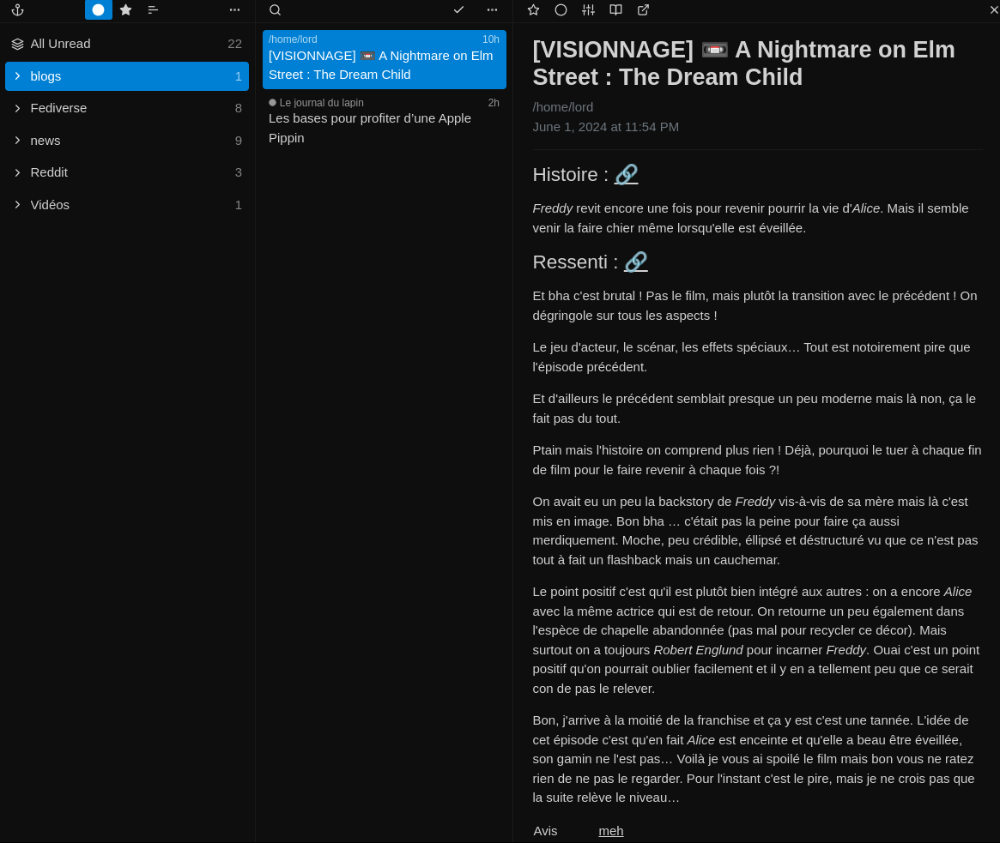

+++
Author = "Lord"
Description = ""
Categories = ["rss", "software"]
menu = "main"
notoc = true
WritingDate = 2024-05-29T11:11:55+02:00
date = 2024-06-02T10:11:55+02:00
title = "Yarr : un lecteur de RSS web qui me plait bien"
editor = "helix"
Audio = ""
Soustitre = ""
+++
## Le RSS c'est la vie.
J'en parle de temps à autre et surtout *j'en suis un très gros consommateur*.
Bon si vous lisez ma prose dégueuk vous êtes probablement déjà amateur de la chose (ouai statistiquement, mon lectorat est geek).

C'est *super pratique* : retrouver du contenu issu de nombreuses sources dans une même interface sans avoir à naviguer de partout.
Le tout synchronisé, sans pub et sans tracking : c'est le web que j'aime.

Et puis *ça permet de suivre des trucs vraiment variés* : des blogs, des BD, des chaînes de vidéastes, des sorties de logiciels voire des sorties de produits culturels, mais aussi les renouvellements de certif TLS, ce qui se raconte sur reddit, ce que racontent des utilisateurs du fediverse et probablement tout un tas d'autres usages.

Mais ça permet surtout de *suivre des contenus au rythme de publication très disparate*.
C'est en plus super cool de voir apparaitre un post d'un blog n'ayant rien sorti depuis quelques années !
*On ne rate rien et on n'oublie rien*.

## TT-RSS
C'est un outil que j'adore notamment via **TT-RSS** qui est un agrégateur web.
Plus de quinze ans qu'il me rend service mais il a quelques points noirs.

Déjà *son dev principal est particulièrement hostile*.
Bon, en tant que simple utilisateur ça m'impacte pas trop.
J'interagis jamais avec lui, hein.
D'autant plus que ça tourne vraiment bien sans maintenance hors changement de machine.

{{}}

Ensuite, ils ont pris la décision de *privilégier Docker et l'utiliser hors de ce bousin n'est pas supporté*.
D'ailleurs c'est bien simple la doc pour faire autrement a été dégagé.
Ça non plus, ça me touche pas trop.
Je l'utilise sans Docker et je l'update direct depuis git (mais ne le dites pas aux devs, je voudrais pas me faire embèter !).

Non ce qui me touche plus c'est … *ses dépendances*.
Ouai c'est souvent ça qui m'emmerde !
TTRSS en lui-même est plutôt robuste, mais il faut lui installer un bon nombre de modules php pour tourner.
Et ces paquets sont souvent mis à jour.

Ha et surtout, ça s'appuie sur *Postgresql pour la base de donnée*.
D'ailleurs c'est pour lui que je me suis mis à postgres (il y a quelques années maintenant).
C'est l'un des rares logiciels à l'époque à ne pas être compatible avec mysql.

Avant il n'y avait pas trop d'alternatives à php/mysql/postgres pour les services web.
Et c'est vrai que mine de rien c'est une stack qui commence à vieillir un peu mais qui a fait ses preuves.
Rhaaa le bon vieux temps où un peu tout nécessitait les mêmes dépendances sans emmerdes de version et tout…

Mais *on est en 2024 et il commence à y avoir tout un tas d'alternatives*.
Beaucoup me rebutent complètement (dès que je vois du docker obligatoire, l'utilisation d'outils issus du monde js, des trucs à base de redis …), mais certaines me font plus de l'œil.
*De nouveaux logiciels aspirent à plus de simplicité et de sobriété aussi bien dans leur <abbr title="user experience : la façon d'intéragir avec notamment via l'interface mais aussi les process">ux</abbr> que dans leur stack logiciel.*
Et dans ce domaine, j'aime les softs s'appuyant sur sqlite pour ne plus avoir de gestion lourde de base de donnée avec notamment les stressantes montées en version.
À cela on ajoute les logiciels en Go facilement compilables voir cross-compilable et avec des binaires statiques sans dépendances c'est le pied.

Ces derniers temps, *j'aspire à un peu plus de simplicité concernant mon auto-hébergement*.
J'essaye de voir à moderniser certains services pour les remplacer par du plus petit, plus simple, plus adapté à du mono-utilisateur.

## YARR
Tout ce cheminement pour vous parler de **YARR** qui est une alternative bien agréable à TTRSS.
Déjà aurevoir PHP, ici c'est du go du coup on se compile ça et pouf on a un binaire à aller coller sur le serveur.
Plus de dépendances et de trucs à installer et mettre à jour, on gère ça à la mano, certe, mais à notre façon, sans emmerde.
Ensuite adios Postgres ou autre, ça sait se contenter de **sqlite**.
Encore une fois, ça simplifie grandement la maintenance.

Bon par contre ces aspects c'est bien, mais ce qui compte avant tout c'est l'interface utilisateur.
*J'ai pas envie de me chambouler : j'ai besoin d'une interface à trois colonnes.*
La colonne qui liste les différents flux, une colonne qui liste les différents items du flux sélectionné et enfin l'affichage de l'item sélectionné.
Après, *je n'ai pas vraiment d'exigences pour les fonctionnalités supplémentaires.*

{{}}

J'ai regardé quelques alternatives au fil des ans mais il y avait toujours un truc qui n'allait pas.
Mais **Yarr** est arrivé !
*C'est ultra sobre (d'aucun dirait dépouillé), mode clair/sombre et ptite fonction cadeau un mode "readability" qui tente d'aller choper le contenu pour les flux tronqués.*
Vraiment c'est tout ce dont j'ai besoin.
*Par contre pas d'utilisateurs multiples, pas d'envoi de mail, à peu près aucun réglage.*

*Le seul truc qui me gêne un peu est l'absence de possibilité de régler le temps de rafraichissement des flux.*
Enfin si mais sans aucune granularité, c'est un réglage global.
Du coup, c'est l'occasion de changer un peu mes habitudes : je réglais la vitesse de rafraichissement des flux pour rafraichir toutes les heures les sites à forte publication et tous les 2/4 jours les autres.
Et je me retrouvais scotché à mon ttrss toute la journée à scroller dès qu'un truc arrivait.
Là, j'ai mis un refresh global toutes les 4h et mine de rien ça me permet de moins attendre inlassablement le moindre nouvel item à lire.
*C'est une conséquence inatendue mais plutôt cool.*

{{}}

*Le logiciel est considéré comme terminé par son auteur*.
Cela implique qu'il n'y aura très probablement pas d'inclusion de nouvelle fonctionnalité, juste des corrections de bugs et des mises-à-jour de dépendances/sécurité.
Ça me va très bien dans l'immédiat.

J'ai largué TTRSS depuis deux semaines et pour le moment ça me va très bien.

Tiens un truc qui n'a jamais vraiment bien marché avec ttrss c'était la recherche.
J'avais l'impression qu'une fois un item sorti du flux rss du site émetteur, il était dégagé de la db ce qui empêchait le fait de le trouver en faisant une recherche.
Là, *yarr semble garder tout dans sa base sqlite et notamment de faire de la recherche sur du texte contenu dans les articles*.
C'est plutôt efficace pour le moment, à voir si ça va tenir dans le temps avec l'agrandissement de la db.

{{}}

Encore un truc inespéré et qui s'avère pratique vient de son interface épurée et de l'ux qui en découle.
*C'est principalement statique et très réactif*.
Pour rafraichir la liste, juste rafraichir la page suffit.
Elle s'ouvre tellement vite que c'est nickel.

Et autre petit bonus, sur un flux de chaine youtube, on peut utiliser la fonction readability pour afficher le player youtube sur la page (mais j'aime pas).
Non, le truc cool, c'est que j'utilise mpv pour lire ça mais que je fais pas ça à la main : j'ai une ptite commande qutebrowser pour balancer un lien à mpv.
Et bien là dans yarr, ça tombe super bien : le lien est toujours le tout premier de la page et donc déclenchable via <kbd>0</kbd> (ou <kbd>00</kbd> s'il y a beaucoup de liens dans la description de la vidèo).
C'est tout bête mais mine de rien ça simplifie un ptit peu plus la vie.

*Voilà, je ne pensais pas pouvoir migrer aussi facilement de logiciel.*
Plus de quinze ans de **TTRSS** remplacé du jour au lendemain par **YARR**.

Voilà, si ça vous intéresse, vous trouverez plus d'info sur [le dépot github du projet](https://github.com/nkanaev/yarr).
Allez, à plus.
