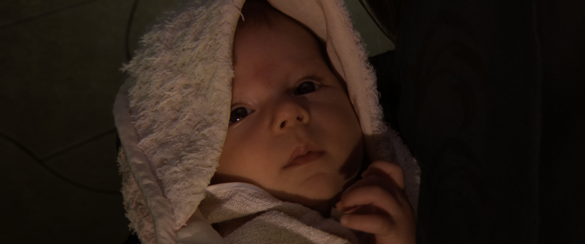

+++
Author = "Lord"
Description = ""
notoc = true
VisionnageDate = ["2021-01-16",""]
date = 2021-01-16T14:03:03+01:00
editor = "kakoune"
year = ["2005"]
Wikipedia = "https://fr.wikipedia.org/wiki/Star_Wars,_épisode_III_:_La_Revanche_des_Sith"
Imdb = "https://www.imdb.com/title/tt0121766/"
Directors = ["George Lucas"]
Actors = ["Hayden Christensen","Natalie Portman","Ewan McGregor"]
RssTag = ["visionnage"]
title = "Star Wars : Episode 3"
Avis_possibles = ["nul","long","court","oneshot","meh","cool","excellent","parfait"]
Avis = ["cool"] 
Saga = ["star wars"]
TopWords=["sabre","laser","planète","galaxie","épopée","trilogie","retournement"]
+++
Bon forcément troisième **Star Wars** d'affilée, j'ai plus grand-chose à raconter.

## Histoire
Ça y est c'est la guerre entre la République et les séparatistes menés par le compte Dooku et le général Grievous.
Les jedis tentent tant bien que mal d'empêcher que la République ne se déchire mais ça devient compliqué malgré leur armée de clones arrivée comme un cheveu sur la soupe.
Cet épisode est la suite directe du précédent.

Les tensions entre *Obi Wan* et *Anakin* se sont apaisées légèrement mais ce dernier reste quand même assez instable psychologiquement.
Désormais marié à *Padmé Amidala* il finit par la foutre enceinte bien que ça ne lui soit pas autorisé.
Il a toutefois des rêves prémonitoires où il la voit mourir lors de l'accouchement.

## Ressenti
On commence par un plan séquence tout fifou où la caméra virevolte dans tous les sens pendant un dogfight en orbite basse.
Ça montre les muscles dès le début : on est LE space opéra !
Et c'est vrai que c'est plaisant à voir cette bataille si proche d'une planète avec plein de vaisseaux, des lasers, des roquettes, des droïdes.

Les effets spéciaux sont encore pas mal du tout pour l'époque.
Comme quoi le premier épisode c'était ptet un peu tôt mais six ans plus tard force est de constater que la technologie a mûri.

J'ai l'impression que cet épisode ils se sont décidés à nous montrer plus de tout.
Plus de planètes, plus d'aliens, plus de "culture", on a presque droit à du cyberpunk pendant quelques secondes dans le fond où l'on voit Coruscant de nuit mais plus proche du sol avec donc tout un tas d'enseignes néons et tout.



Étonnament dans cet épisode je trouve que *Palpatine* est plus subtil avant de révêler son identité.
Dans les épisodes précédents ils n'hésitaient pas à faire des remarques assez équivoques où bien des grimaces assez peu subtils.
Le mec était clairement diabolique ça se voyait alors que là, au début du film quand il joue les prisonniers… bha il est plus crédible.

Ce n'est que maintenant qu'un droïde utilise ses facultés de droïde à ne pas avoir besoin de respirer, avoir une force surhumaine, ne pas avoir techniquement besoin de sa tête pour fonctionner.
Et du coup ça surprend un peu car on nous y a vraiment pas habitué pourtant ça amène un peu de changements.

{{}}

Un truc que je trouve un peu concon…
À la fin il faut planquer les deux bébés.
Il y en a un qui est filé au *sénateur Organa* (ça sera donc *Léïa*) qui s'est affiché clairement comme étant contre ce qui s'est passé aux jedis donc de base il est catalogué comme louche.
C'est ptet pas la meilleure planque.
Mais alors le second bébé c'est pire !
Il est remis dans la famille d'origine d'*Anakin* sur sa planète Tatooïne.
S'il y a bien un endroit où il est susceptible de retourner pour une raison ou une autre c'est bien là-bas !

C'est donc la fin de cette trilogie qui remet toutes les pièces en place pour pouvoir s'imbriquer dans la trilogie originelle.
Forcément les révélations de cette trilogie gâche l'effet de surprise pour la suivante mais bon que voulez-vous…

Bon du coup, je sais pas si c'est moi qui ai raté quelque chose mais on ne sait pas vraiment d'où il vient le *Anakin*.
Dans l'épisode 1, sa mère nous dit qu'elle ne comprend pas vraiment comment elle l'a eu, qu'il n'a pas de père.
Bon du coup, est-ce que c'est juste une façon de parler ou bien il y a vraiment eu un truc surnaturel à ce propos ?
Est-ce que ce serait un Sith très puissant qui l'aurait créé de toute part via les midichloriens ce qui expliquerait ses aptitudes hors du commun ?

